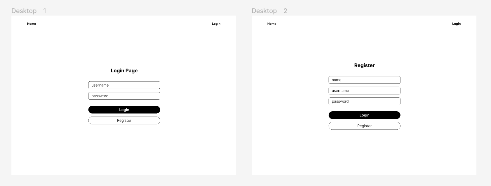
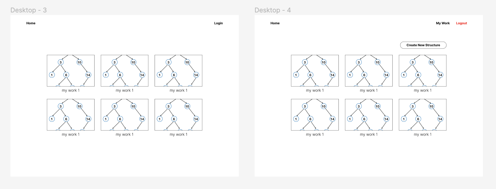
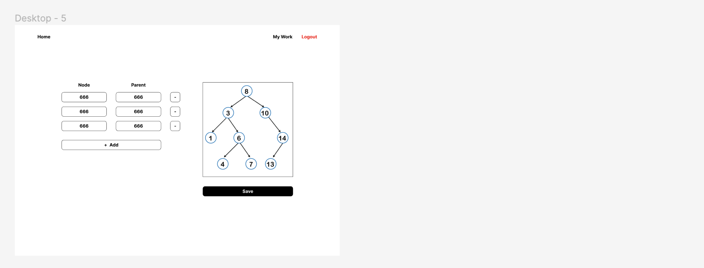

# Fullstack Coding Test

Instructions:
- Fork this repository.
- Implement each solution on a folder by the task number.
- Invite our email to become collaborator when you finish your work.

## General Programming

**1**. Implement a program to find intersection array of two array A and B, as example below:
```
A = [1, 2, 3, 4, 5]
B = [2, 3, 4, 5, 6]
intersection = [2, 3, 4, 5]


A = [9, 8, 3, 4, 5]
B = [2, 7, 4, 9, 1, 0]
intersection = [4, 9]
```

**2**. Determine complexity of the program above, with big O notation!

**3**. Implement a function to generate tree from array and flatten tree to array, as example below:
```
Case
+----------+----------+
| Node     | Parent   |
+----------+----------+
| 1        |          |
| 2        | 1        |
| 3        | 2        |
| 4        | 2        |
| 5        | 1        |
| 6        | 1        |
| 7        | 6        |
| 8        | 6        |
| 9        | 8        |
+----------+----------+
Node 1 is root

interface OrganizationNode {
  label: number
  parent: number | null
}

array A = [
  { "label": 1, "parent": null },
  { "label": 2, "parent": 1 },
  { "label": 3, "parent": 2 },
  { "label": 4, "parent": 2 },
  { "label": 5, "parent": 1 },
  { "label": 6, "parent": 1 },
  { "label": 7, "parent": 6 },
  { "label": 8, "parent": 6 },
  { "label": 9, "parent": 8 }
]

interface Tree {
  label: number
  children: Tree[]
}

tree A = {
  "label": 1, 
  "children": [
    {
      "label": 2, 
      "children": [
        { "label": 3, "children": [] },
        { "label": 4, "children": [] }
      ]
    },
    { "label": 5, "children": [] },
    {
      "label": 6, 
      "children": [
        { "label": 7, "children": [] },
        {
          "label": 8, 
          "children": [
            { "label": 9, "children": [] }
          ]
        }
      ]
    }
  ]
}
```

Generate tree is transform **array A to tree A**. Flatten tree is transform **tree A to array A**.

## Fullstack

**4**. **Task Description** The company wants to create a website galley of organization structure. A user must create an account to use the website. User can login to using user that has been created. User can create an organization structure by input an array of organization node as example on task **3** above. System is expected to render the organization node realtime while using input the organization node. After finish the organization structure, use can save the work and find all its saved works in gallery page.

Implements the system using at least minimum four components below:
- Data Schema / ERD
- Database
- Backend Program using API
- Frontend Website

Mockup:




